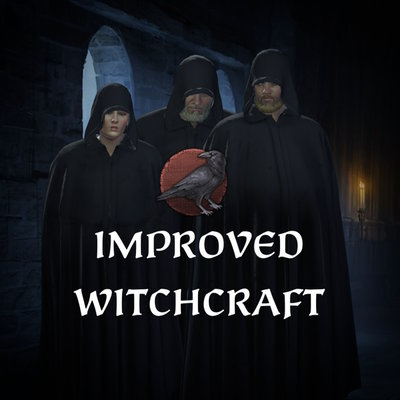

  

## Improved Witchcraft

¹Also check [Improved Witchcraft - Tenet Submod](https://steamcommunity.com/sharedfiles/filedetails/?id=3566658247)

## Overview

Ever felt that the Grand Rite was a bit dull and boring? Have you wished you could have more from it? The Improved Witchcraft Mod seeks to unlock the true potential of witchcraft, transforming the Grand Rite from a simple activity into a new expanded experience.

Delve deeper into the occult with new intents for your rituals, from seeking powerful boons from otherworldly entities to unleashing devastating curses upon those who have wronged you.

## Features

- **Three New Grand Rite Intents:** Change the purpose and outcome of your Grand Rite with the "Seek Blessing","Hex Enemy" and "Seek Forbidden Knowledge" intents.
- **Added Activity Options:** Choose the level of extravagance for your rite, from a humble, secret gathering to a grand ceremony that will have the very stars bearing witness. Will effect opinion gain of guests and your stress loss.
- **New Flavorful Events for intents:** Experience new narrative events tied to your chosen intent, with a range of outcomes that can empower or endanger your character.
- **Unique Character Modifiers & Boons:** Your rituals now grant tangible rewards, from temporary boosts to your skills to powerful, long-lasting boons.
- **Leveled Witch Trait:** As your experience grows, so does your power. Progress from a simple Witch to an Adept and perhaps even a Master, unlocking more potent magical effects.
- **2 New Cultural Traditions:** New witch-themed cultural traditions, "Occult Practices, Folk Healers" to further integrate witchcraft into your society.
- **A New Court Position:** [Court Alchemist](https://steamcommunity.com/sharedfiles/filedetails/?id=3548614933), big thanks to [Ledmano](https://steamcommunity.com/profiles/76561198097768858) for letting me integrate his mod.
- **Court Position Mod Integration:** My new [Court Herbalist](https://steamcommunity.com/sharedfiles/filedetails/?id=3571752592) mod goes hand-in-hand and designed with Improved Witchcraft in mind.
- **7 Language Support**

## Intents

The heart of this mod is the addition of new intents to the Grand Rite activity.

- **Seek Blessing:** Gain random powerfull boons instead of perk points. Related skill of the boon will be randomly selected just like regular grand rite intent.
- **Hex Enemy:** You can hex and condemn your rivals or murder targets. They can get negative modifiers, negative traits. Experienced witched can even condemn plague on their rivals lands.
- **Seek Forbidden Knowledge:** You gain lifestyle perk points from your selection of lifestyles. Its a bit risky and stressfull. You will need a lot of learning and luck for that **OR** you can just get some lifestyle experience without the risks. 

## Traditions

**Occult Practices**

_"Views on magic as a discipline rooted in esoteric knowledge. Its followers believe that through the careful application of rituals, symbols, and incantations found in forbidden lore, one can command the unseen forces of the world. Power is not given, but seized through understanding."_

- The Witch trait is viewed as prestigious and grants a monthly prestige bonus.
- Hosting a grand rite will reward prestige.
- It's easier to convert to witch the characters of this culture with this tradition.
- The cooldown for the Grand Rite activity is reduced by 1 year.

**Folk Healers**

_"There are those who believe that true healing comes from the union of earth and spirit. Knowledge of herbs mends the flesh, but only the wisdom of the old ways can soothe a troubled soul or ward off unseen blights. Their most respected healers are therefore those who walk both paths, blending practical medicine with the deeper magic of the natural world."_

- Can appoint Court Alchemist Position.
- Can appoint Court Herbalist Position. _Only when my [Court Herbalist](https://steamcommunity.com/sharedfiles/filedetails/?id=3571752592) mod is enabled._
- Can gain Wise man trait for attending a grand rite.
- Herbalist trait is easier to gain with odds favourited to player in Grand Rite. (20% bonus chance to gain herbalist trait with event.)
- Court Phycisians are cost slightly less to hire.

## Tenets
**Coven Worship**
#### Note¹: For compatibility reasons I made tenet addition a submod. Cause I can't just add another tenet just like a trait or a tradition, I have to override the full file to add a single tenet so for folks who use another mod that adds tenets or modifies the file it would be incompatible.
For thoose who want the tenet addition
[Improved Witchcraft - Tenet Submod](https://steamcommunity.com/sharedfiles/filedetails/?id=3566658247)

_"True power is not found in solitude, but in the shared will of the coven. We believe that our strength is magnified when we gather, and our most sacred rites bind us together as a spiritual family."_

- Hosting a grand rite will reward piety.
- The cooldown for the Grand Rite activity is reduced by 1 year.
- Same Faith opinion **+5**
- Different Faith opinion **-5**
- Learning **+1**

Overrides File:

- common\religion\doctrines\00_core_tenets.txt

## Inspiration

Witch Coven system in CK3 was fun and all but after a while hosting a grand rite turns into repeating boring step, host grand rite, get a random perk point etc. I always wanted some more variety and I believe it will take some time Paradox will make some witch related content and expand upon it. My goal was to add more flavor and to make players feel like they have more choices with risks and rewards.

**Rate and add to favourites if you liked it! Thank you.**

## Notes

_While I have tested it, there may be balancing issues or minor bugs.Altough I can't promise, I plan to add more intents, events, options and perhaps even coven-related decisions in the future. All feedback and suggestions are welcome!_

Court Herbalist mod is not acctually required but it goes well with it. I designed with Improved Witchcraft in mind.

## Compatibility
Save game compatible but **new game recommended** for compatibility reasons with other mods. Especially for Court Herbalist.
It will likely conflict with any other mod that alters the Grand Rite activity or witch-related events. For creators of compatibility patches, here are the files/keys this mod currently overrides:

- common\activities\activity_types\00_witch_ritual.txt
- events\witch_events.txt
- convert_to_witchcraft_interaction (character_interaction)
- convert_to_witchcraft (scheme)
- grand_rite_good_outcome (scripted effects) 
- grand_rite_poor_outcome (scripted effects) 
- witch_3014_can_have_sex_trigger (scripted effects) 
- witch_3014_sex_partner_trigger (scripted effects) 
- witch_3014_loved_sex_partner_trigger (scripted effects)
- witch life (trait)
- high_skill_court_physician_cost low_skill_court_physician_cost  (scripted_values)

### Compatiblity Patches
[Witchcraft](https://steamcommunity.com/sharedfiles/filedetails/?id=3567603271)

## Languages
Translations besides English are machine translations and may be inaccurate!_

- English
- French
- German
- Korean
- Polish
- Russian
- Spanish

## Translations
[Chinese](https://steamcommunity.com/sharedfiles/filedetails/?id=3403925213)

